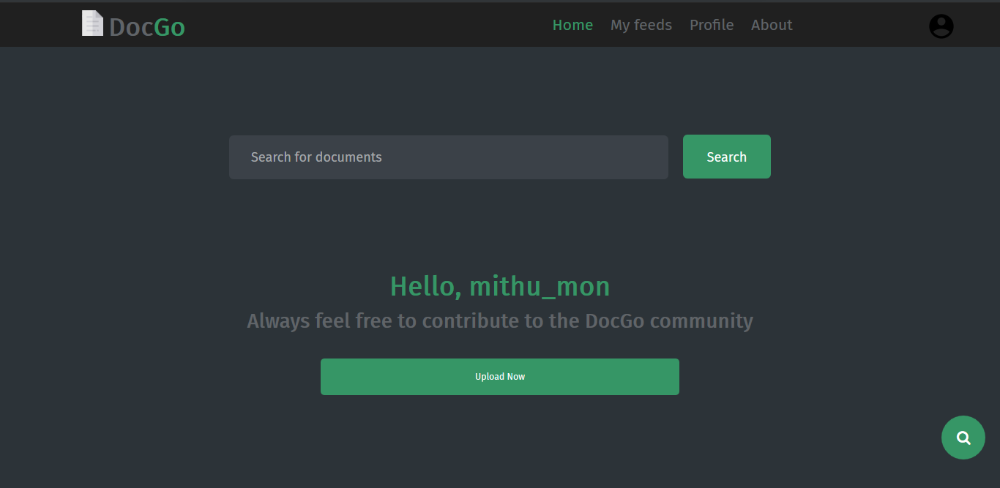
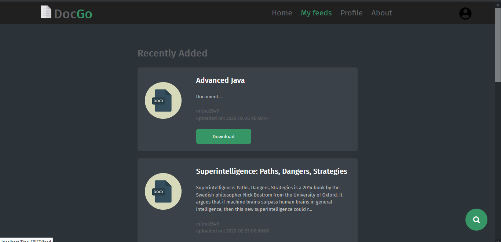

# DocGO

> DocGo is a Document sharing platform and is been worked on as a college project.

### Getting Started

🔹Install XAMPP or any appropriate Server for your machine.

🔹Clone the repo

<pre>git clone </pre>

🔹Import the <code>doc_srist.sql</code> file to your MySQL.

🔹Start Apache and MySQL

🔹Open up your localhost

🔹All Done!
